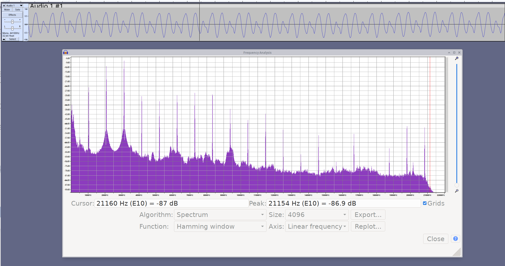

# hello-audio: emit ~1KHz square wave on MB2 speaker
Bart Massey 2023

This is the "hello world" of audio programs.

In this branch, though, it's the complicated audio program
that sort of works. This uses the PWM interface on the MB2
to generate the sine wave: 8 bits at 62.5K samples per
second.

This emits a C6 at around 1043Hz, which is supposed to be a
sine wave, but is pretty janky. Here is Audacity showing the
speaker output via a good reference microphone.

The software apparently still needs work: I suspect that
glitch every cycle can be corrected with some work.
However, the MB2 speaker circuit (and speaker) is also a bit
special. Much better results can be attained with an
external audio output circuit.

# Acknowledgements

Thanks much to Keith Packard for an epic mult-hour debugging
session where we finally solved the last fundamental
problems with this using an oscilloscope, experimentation
and meditation.

# License

This work is licensed under the "MIT License". Please see the file
`LICENSE.txt` in this distribution for license terms.
